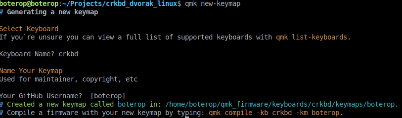
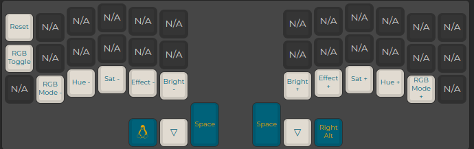
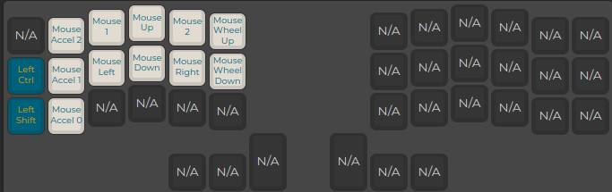

## Setup

To send the config into your keyboard follow this tutorial made for [Hola Mundo](https://youtu.be/lDqJR9b6w7s?si=xAhfJ351-DeIea20&t=1177)

## Edit

Using [this list](https://docs.qmk.fm/#/keycodes) you could be able to modify the keys as you need, or by editing _crkbd_rev1_boterop.json_ in [QMK Configurator](https://config.qmk.fm/#/crkbd/rev1/LAYOUT_split_3x6_3)

## Install qmk

```sh
sudo apt-get install gcc-avr avr-libc binutils-avr avrdude
python3 -m pip install --user qmk
qmk setup
```

## Compile Into Keyboard

If you edited the _.json_ file you must run `qmk json2c crkbd_rev1_boterop.json > keymap.c` to create _.c_ file

Now with the _keymap.c_ create a new qmk keymap using `qmk new-keymap`



Then, following the folder where keymap was created (this case _/home/boterop/qmk_firmware/keyboards/crkbd/keymaps/boterop_) paste your _keymap.c_ and then compile it `qmk compile -kb crkbd -km boterop` (change _boterop_ with your keymap name)

Now it is time to install it, you can follow the same tutorial from [Setup](#setup)

#### For me:

```sh
    cd ../../../
    qmk flash -kb crkbd -km boterop
```

## Layers

### DVORAK


### NAVIGATE


### SYMBOLS


### NUMPAD


### ADJUST



### MOUSE


